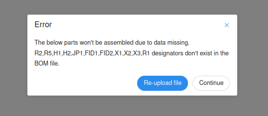
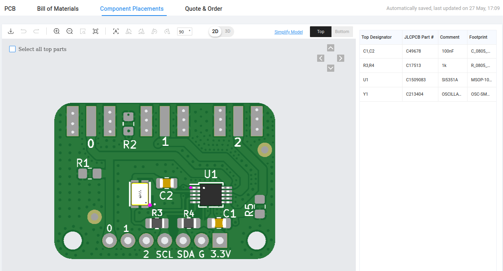

This version is ready for JLCPCB's PCBA process. Enjoy! ;)

This project uses KiCad 9.0.

It is OK to see the following "errors" in the JLCPCB PCBA process.

Check proper component placement.

Update (March-2025): These `Adafruit-Si5351A-v5` PCBs were assembled by JLCPCB and they work great!
