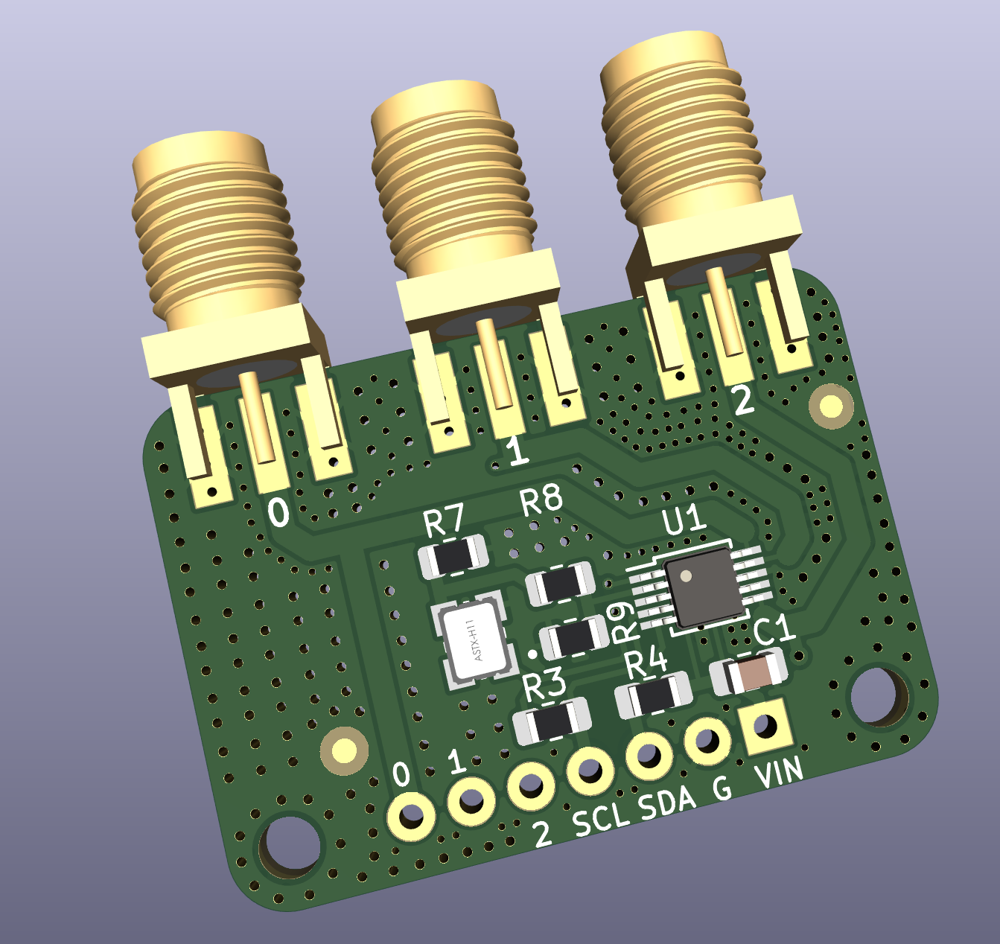

#### Notes

Note: We are using KiCad 7.0.x version to build this project.

#### PCB render

#### BOM Sources

- https://www.lcsc.com/ - MS5351M

- https://www.comkey.in/ - SMD passives

- https://www.ktron.in/ - SMA connectors for cheap

- https://www.semikart.com/ - TCXOs

Note: International buyers can buy from DigiKey or Mouser.

#### Credits

- Sambhu Dharmadevan (VU3KQF)

- Dhiru Kholia (VU3CER)

#### Supported TCXO Modules

- Jauch Quartz O 25,0-JT32C-A-K-3,3-LF

- Abracon ASTX-H11-25.000MHZ-T

- [Experimental] KDS Daishinku 1XTW26000MAA
